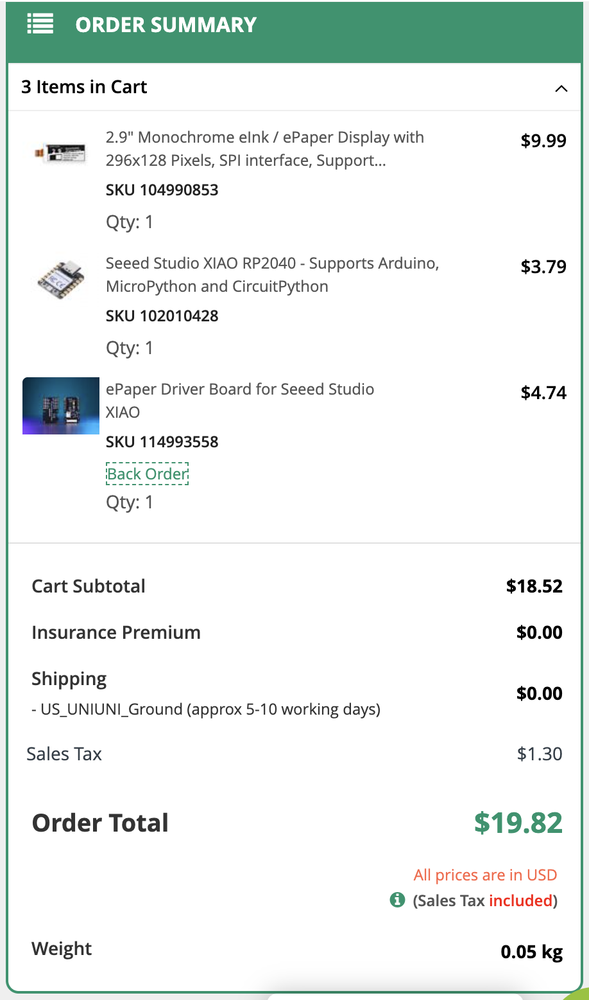
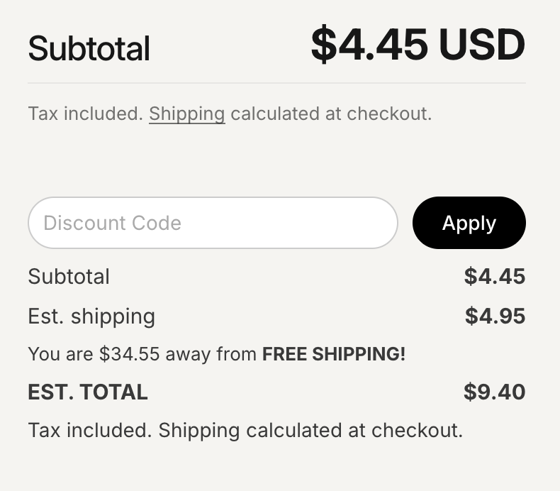
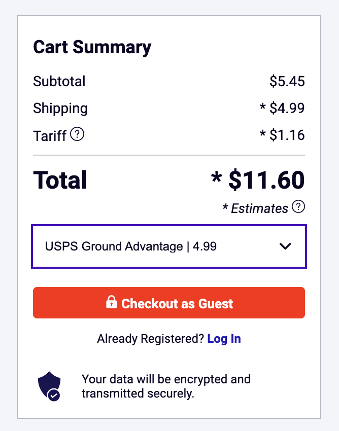
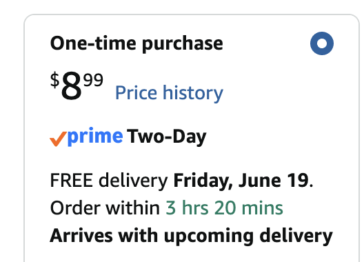
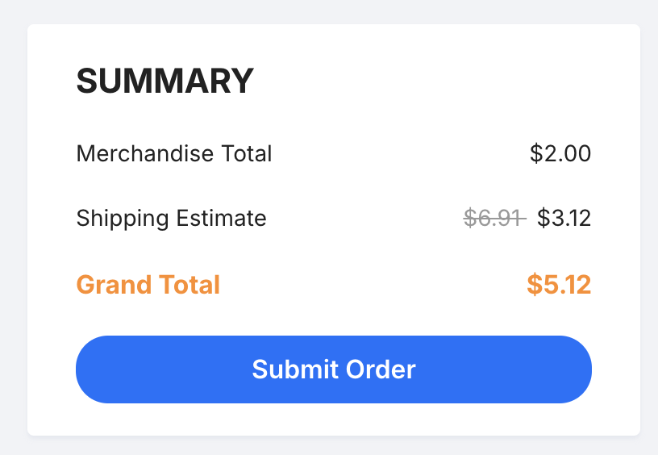
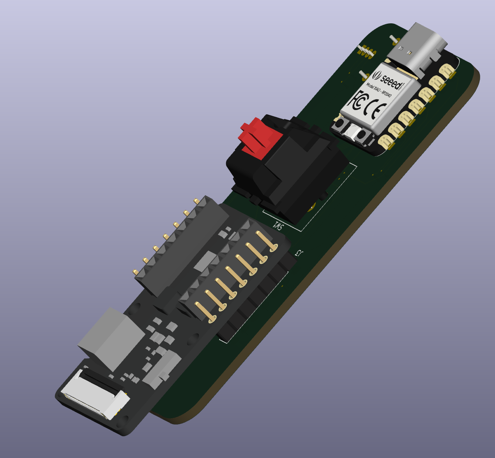
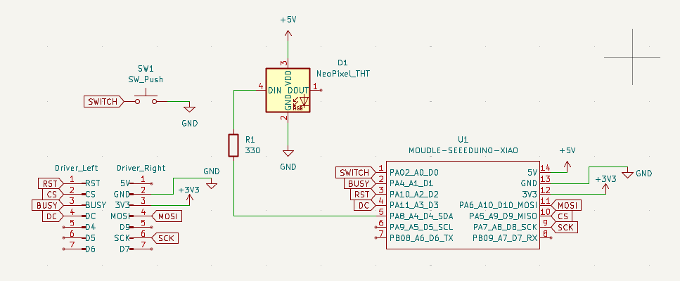
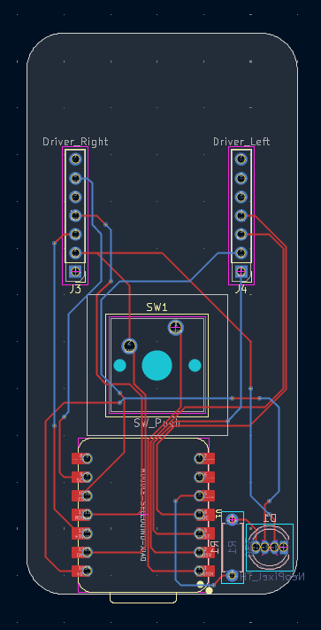
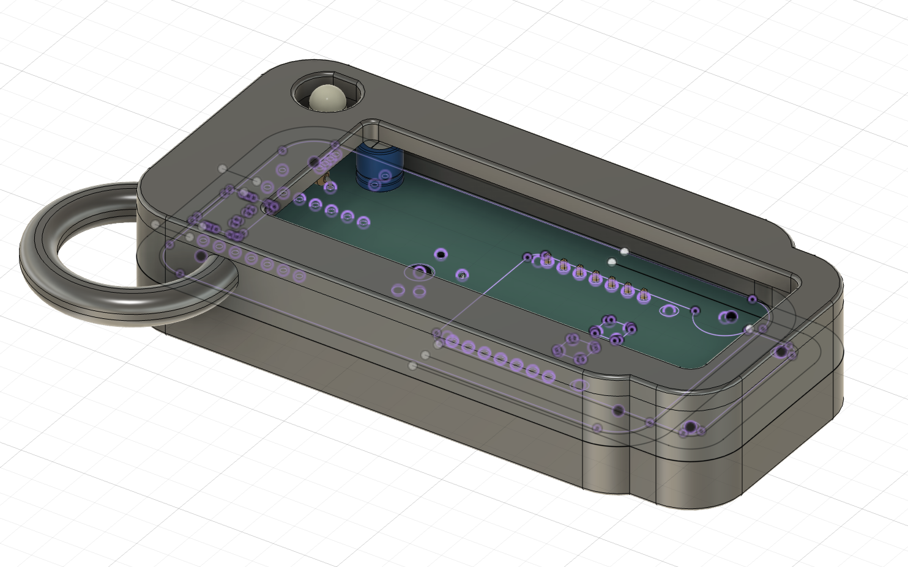

# eink Pendant

It's a PCB! No wait, its a keychain! Actually, its both. 

The idea for this PCB is, you press a button, and it changes the LED color and the image displayed on the eink display. It's a pretty simple concept, but I still enjoyed making it :)

## BOM
| Item                                      | Qty | Unit Price | Total Price | Product Link                                                                                                                                                                                                                       |
| ----------------------------------------- | --- | ---------- | ----------- | ---------------------------------------------------------------------------------------------------------------------------------------------------------------------------------------------------------------------------------- |
| Seeed Studio XIAO RP2040                  | 1   | $3.79      | $3.79       | [https://www.seeedstudio.com/XIAO-RP2040-v1-0-p-5026.html](https://www.seeedstudio.com/XIAO-RP2040-v1-0-p-5026.html)                                                                                                               |
| 2.9" Monochrome eInk / ePaper Display     | 1   | $9.99      | $9.99       | [https://www.seeedstudio.com/2-9-Monochrome-ePaper-Display-with-296x128-Pixels-p-5782.html](https://www.seeedstudio.com/2-9-Monochrome-ePaper-Display-with-296x128-Pixels-p-5782.html)                                             |
| ePaper Driver Board for Seeed Studio XIAO | 1   | $4.66      | $4.66       | [https://www.seeedstudio.com/ePaper-breakout-Board-for-XIAO-V2-p-6374.html](https://www.seeedstudio.com/ePaper-breakout-Board-for-XIAO-V2-p-6374.html)                                                                             |
| Cherry MX Blue Clicky RGB Switches        | 10  | $0.445     | $4.45       | [https://www.thockking.com/products/cherry-mx-blue-rgb-switches?variant=42102661087448](https://www.thockking.com/products/cherry-mx-blue-rgb-switches?variant=42102661087448)                                                     |
| NeoPixel Diffused 5mm Through-Hole LED    | 1   | $4.95      | $4.95       | [https://www.digikey.com/en/products/detail/adafruit-industries-llc/1938/6827082](https://www.digikey.com/en/products/detail/adafruit-industries-llc/1938/6827082)                                                                 |
| 330 Ohm Metal Film Resistor               | 5   | $0.10      | $0.50       | [https://www.digikey.com/en/products/detail/koa-speer-electronics-inc/MF1-4LCT52R331J/21679525](https://www.digikey.com/en/products/detail/koa-speer-electronics-inc/MF1-4LCT52R331J/21679525)                                     |
| 3.7V Lipo Battery                         | 1   | $8.99      | $8.99       | [https://www.amazon.com/Qimoo-Battery-Rechargeable-Connector-Electronic/dp/B0CNLPBM2L?nsdOptOutParam=true&sr=8-7](https://www.amazon.com/Qimoo-Battery-Rechargeable-Connector-Electronic/dp/B0CNLPBM2L?nsdOptOutParam=true&sr=8-7) |
| PCB                                       | 5   | N/A        | $2.00       | N/A                                                                                                                                                                                                                                |
 
## Cart Screenshots

## Screenshots

